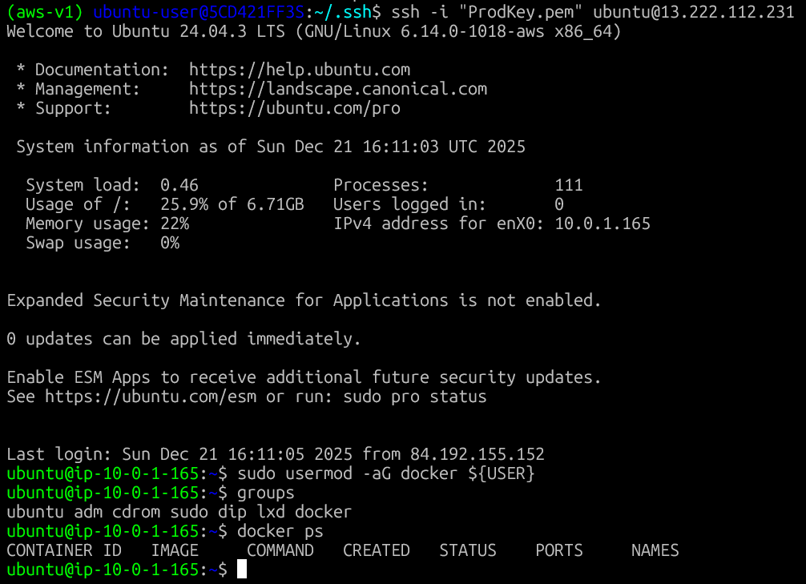
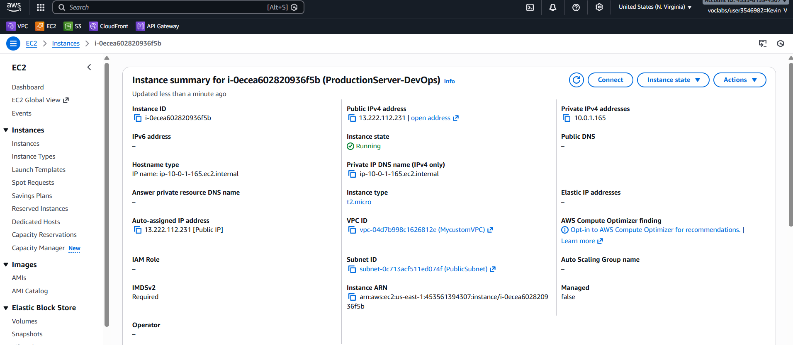
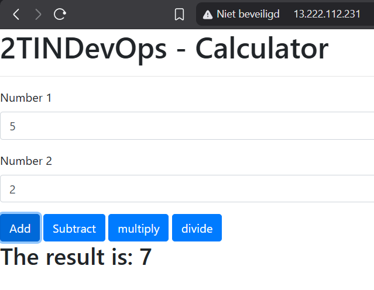
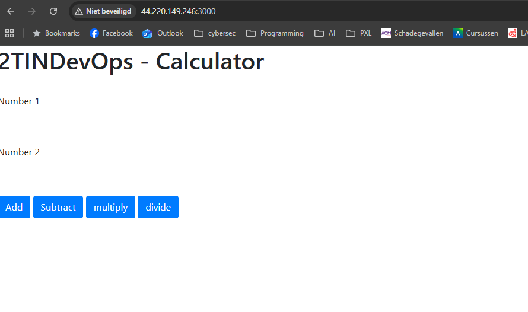
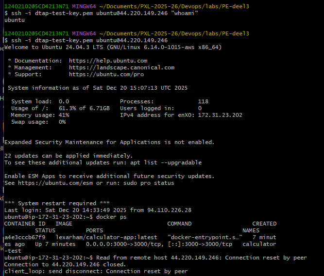

# PRODUCTIONSERVER

## I Aanpassing rechten voor gebruik van Docker zonder sudo

We hebben de gebruiker toegevoegd aan de `docker` groep met het commando `sudo usermod -aG docker $USER`, aangezien het gebruik van `sudo` niet hoort volgens de security principes. Hieronder zie je een screenshot waarin het commando wordt uitgevoerd, met de output van `groups`en `docker ps` die beiden succesvol worden uitgevoerd zonder `sudo`.

## II Bewijs werkende app

### Instancegegevens productieserver

### Bewijs werkende app op productieserver

# Assignment 6 – Environments (DTAP)
## Oplossing – Test deployment

### Testserver configuratie
De testserver is een Ubuntu Server VM in AWS (t2.micro) met een public subnet en public IP.
De security group laat verkeer toe op poort 22 (SSH) en poort 3000 (applicatie).

### Testserver – Applicatie bereikbaar

De calculator applicatie is succesvol gedeployed via de test deployment workflow
en is bereikbaar via de browser op poort 3000.

URL:
http://44.220.149.246:3000

### Docker & rechten
Docker is geïnstalleerd op de testserver.  
De gebruiker `ubuntu` werd toegevoegd aan de `docker` groep zodat Docker-commando’s zonder `sudo` uitgevoerd kunnen worden.
Dit werd getest met `docker ps` zonder sudo.
Uitgevoerde stap:
sudo usermod -aG docker ubuntu

Na opnieuw inloggen werd dit getest met:
docker ps
Dit commando werkt zonder sudo

### Test deployment workflow
De test deployment workflow doorloopt het volledige CI-proces:

- Install dependencies  
  NodeJS wordt opgezet en `npm install` wordt uitgevoerd.

- Build artifact  
  Er wordt een Docker image gebouwd van de calculator applicatie.

- Push artifact  
  De Docker image wordt gepusht naar DockerHub (`lexarham/calculator-app`).

- Deployment  
  Via SSH wordt de container gedeployed op de testserver.
  Eventuele vorige containers worden verwijderd.
  De applicatie draait op poort 3000 en blijft actief na de pipeline.

### EindResultaat
De test deployment werkt volledig correct en is succesvol getest op AWS.

b)
